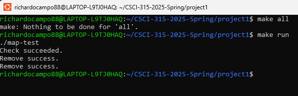
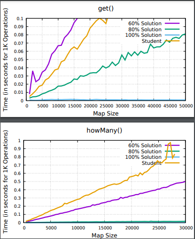

[Back to Portfolio](./)

Large Map with Fast Prefix Matching
===============

-   **Class: CSCI 315 Data Structure Analysis** 
-   **Grade: A** 
-   **Language(s): C++** 
-   **Source Code Repository:** [richardocampo88/largemap](https://github.com/richardocampo88/CSCI-315-2025-Spring/tree/master/project1)  
    (Please [email me](mailto:example@raocampo@student.csuniv.edu?subject=GitHub%20Access) to request access.)

## Project description

This project has been designed to create a custom "Map" data type that stores a student's full name (key) and an unsigned integer ID (value). The full name must meet the following format specifications: first name followed by last name separated by a single space character, only characters from the alphabet must be used in both the first and last names, and both the first and last names must start with a capital letter. There may only be one ID assigned per full name.

## How to compile and run the program

Utilize g++ to compile the source files as this project is run in C++.

Compile the program using the following command as this will compile your program automatically: **make all**

Once you have compiled the program, you can run it with: **make run**

## UI Design

This project does not have a graphical user interface (gui). Instead, it is a backend/data structures project focused on providing fast execution times, low memory usage, and high correctness rates. The "interface" for this project exists only in terms of the C++ class interface meaning the public methods that allow a user or test program to interact with the data structure.

  
Fig 1. Command Line

  
Fig 2. Data output from program. Results may vary.

## 3. Additional Considerations

Fast execution time is very important especially regarding operations get() and howmany(), so memory efficiency is critical since storing all possible combinations of first and last names (and their ids) would take over 5GB of memory as well as hash maps explicitly forbidden from being used.

For more details see [CSU, CSCI 315 Data Structures](https://github.com/csu-cs/CSCI-315-2025-Spring).

[Back to Portfolio](./)
