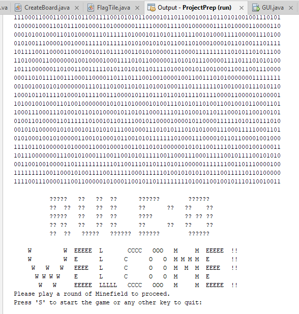
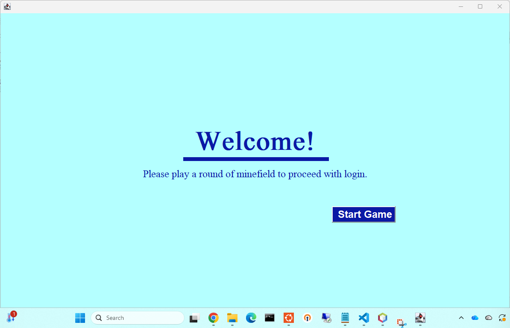
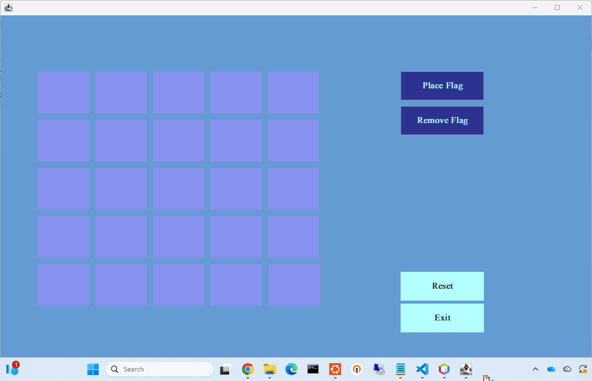
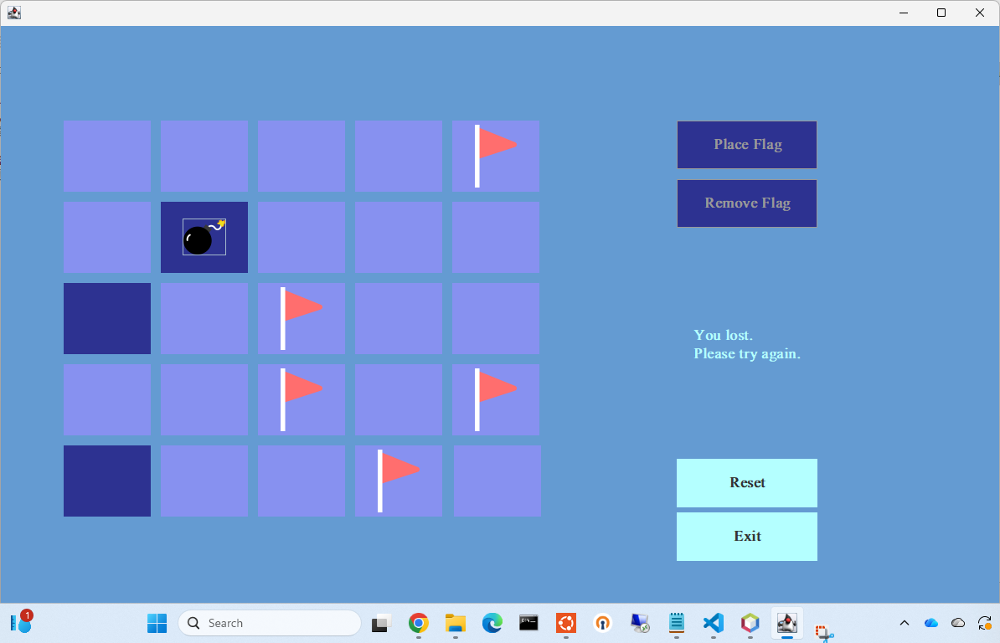
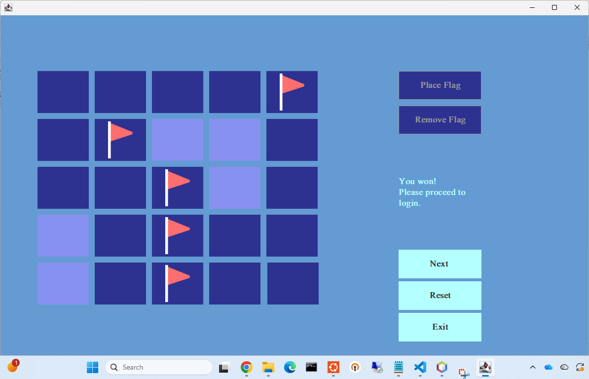
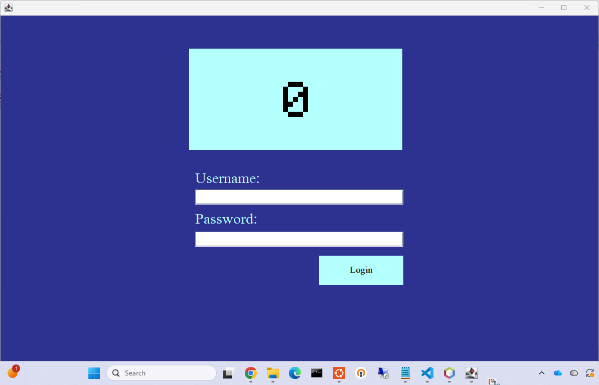

[Back to Portfolio](./)

Minefield
===============

-   **Class: CSCI 325 Object-Oriented Programming** 
-   **Grade: A** 
-   **Language(s): Java** 
-   **Source Code Repository:** [features/mastering-markdown](https://github.com/csu-cs/CSCI-325-Minefield)  
    (Please [email me](mailto:raocampo@student.csuniv.edu?subject=GitHub%20Access) to request access.)

## Project description

This team project was a "creative authentication concept" that ties gaming to access of the system. As the program opens up, the user will see a welcome screen and then will be asked to start a round of Minefield. Once the user completes the round of Minefield, they will then be able to input their username and password to gain access to their own command interface or gui. If the inputted username and password are incorrect, the user will have to go back and complete another round of Minesweeper before they will be able to try again. The document stated that this concept was created to show off possible future technology and highlight the importance of proper authentication when it comes to granting users access to systems. The idea behind this concept was partially influenced by the movie *War Games*, released in 1983.

## How to compile and run the program

Users would have to need Apache Netbeans IDE Installed, import the project contents, and then run the project. Once the project runs, users would follow on-screen commands.

## UI Design

The program would utilize multiple interfaces as users continue through on-screen commands. The would first approach the Welcome Screen (Fig. 1) following by the start game option (Fig. 2). Users are then brought to the Minefield board layout (Fig. 3) and play the traditional Minfield game by placing flags. If the user fails, they are met with a "You lost" message (Fig. 4) and can attempt to try again. After a user successfully completes the game (Fig. 5), they are then brought to the login screen as the last step of the process (Fig. 6).

  
Fig 1. Welcome Screen

  
Fig 2. Start Game

  
Fig 3. Minefield board layout

  
Fig 4. "You lost."

  
Fig 5. "You won!"

  
Fig 6. Login Screen

## 3. Additional Considerations

Sed ut perspiciatis unde omnis iste natus error sit voluptatem accusantium doloremque laudantium, totam rem aperiam, eaque ipsa quae ab illo inventore veritatis et quasi architecto beatae vitae dicta sunt explicabo. 

For more details see [GitHub Flavored Markdown](https://guides.github.com/features/mastering-markdown/).

[Back to Portfolio](./)
