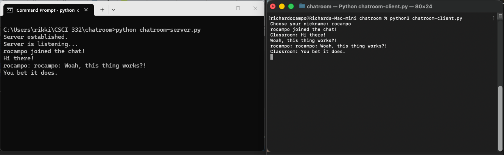

[Back to Portfolio](./)

Chatroom
===============

-   **Class: CSCI 332 Applied Networking** 
-   **Grade: A** 
-   **Language(s): Python** 
-   **Source Code Repository:** [richardocampo88/chatroom](https://github.com/richardocampo88/CSCI-332-project)  
    (Please [email me](mailto:RAOcampo@student.csuniv.edu?subject=GitHub%20Access) to request access.)

## Project description

This project is a simple chatroom app based on python. With this application, multiple users can interact with each other using the internet. It is broken up into two sections: the server portion and a client portion. The server functions as the main hub of the chat room where all client activity takes place. Each client connects to the server, communicates with the server, and receives information from the server.

## How to compile and run the program

There is no compilation process. Instead, this executes Python code directly. Before executing your application, make sure that Python is installed on each machine. Additionally, make certain that both computers are located on the same network if testing across two separate computers.

Required files:

chatroom-server.py: Server file for the machine hosting the chat session
chatroom-client.py: Client file for each user who joins the chat session

Starting the Server:

Open Command Prompt or Terminal on the machine acting as the server. Navigate to the directory containing chatroom-server.py and execute: **python chatroom-server.py**.

For some Mac installations, you might need to execute: **python3 chatroom-server.py**

Your server should now display messages:
Server Established.
Server Listening... 

Starting the Client:

Open Terminal or Command Prompt on the client machine. Navigate to the directory containing chatroom-client.py and execute: **python chatroom-client.py**

Or, if you're on a Mac: **python3 chatroom-client.py**

At this point, your client should ask the user for their chosen nickname. Upon selecting a nickname, your client will connect to your server and enter the chat session.

## UI Design

The user experience/UI is purely command-line/text-based. This keeps things simple and focused on usability/functionality. There is an update when the server starts listing for incoming clients. When a new user joins the chat session, there is an update showing they have joined (Fig. 1).

  
Fig 1. The chatroom functionality

## 3. Additional Considerations

For initial setup, the client file must have its own configuration for the server's IP address and port number.

As an example:

client.connect(('10.0.0.16', 5000))

And similarly, your server must be bound to the same port number. For instance:

server.bind(('0.0.0.0', 5000))

If the port numbers don't match, your clients won't be able to successfully connect.

Your server must be activated prior to attempting to connect any clients. If clients attempt to connect before activating your server, it will be unable to establish a connection. Also, clients must utilize the correct IP address associated with your server, and both clients and servers must utilize identical port numbers. Both devices utilized in testing (on two different computers) must either share the same local network or additional networking setup (e.g., port forwarding) needs to occur in order for successful connection(s). This project is intended to remain relatively basic to understand how python works.

[Back to Portfolio](./)
