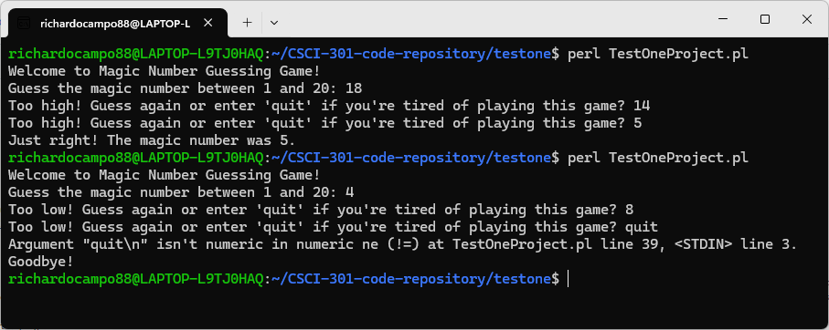

[Back to Portfolio](./)

Magic Number Guessing Game
===============

-   **Class: CSCI 301 Survey of Scripting Languages** 
-   **Grade: A** 
-   **Language(s): Perl** 
-   **Source Code Repository:** [richardocampo88/magicnumber](https://github.com/richardocampo88/CSCI-301-project)  
    (Please [email me](mailto:raocampo@student.csuniv.edu?subject=GitHub%20Access) to request access.)

## Project description

When the application is initiated, it will generate a random “magic number”, ranging between 1 and 20, and request that the user attempts to guess the magic number. Following every attempt to guess the magic number, the application will advise the user if their guess was below or above the actual value of the magic number. The application will continue to prompt the user to make another guess until the user either correctly guesses the magic number or selects the option to stop playing. If the user successfully identifies the magic number, then the application will provide a congratulatory message displaying the magic number.

## How to compile and run the program

The application does not require compilation due to being a Perl script. In order to execute this Perl script, you simply run perl followed by the name of your Perl script in the shell/terminal window like this: **perl magicnumber.pl**

Once executed, the script will present a welcome message, ask the user to guess a number between 1 and 20, and await additional input entered via standard input.

## UI Design

The game utilizes a text-based console interface. Interaction occurs solely between printed messages to the user and keyboard input entered by the user at their local terminal (Fig. 1)

  
Fig 1. The application interaction

• The user is greeted and invited to participate in the game.

• The user is asked to enter a guess for the magic number.

• Feedback about how close they were with their most recent guess is provided after each guess.

• The user wins when they finally guess the correct number or exits the game when prompted to do so.

## 3. Additional Considerations

One minor issue exists in terms of how the program handles both comparisons of guesses against the randomly created magic number AND processing of input that includes typing ‘quit’. As such, processing of ‘quit’ is slightly less organized than it could have been. However, overall structure and sequence of the game is relatively simple to follow.

[Back to Portfolio](./)
